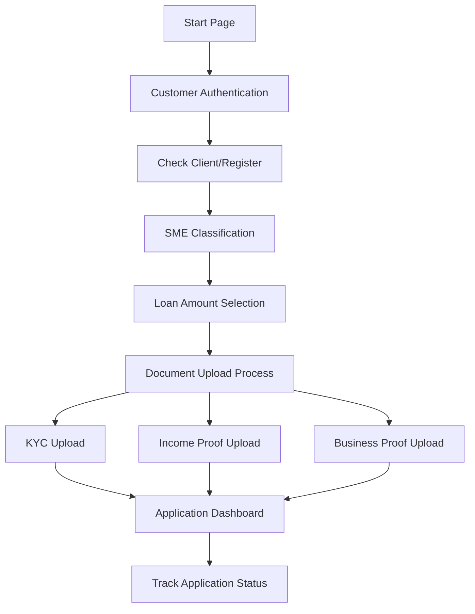
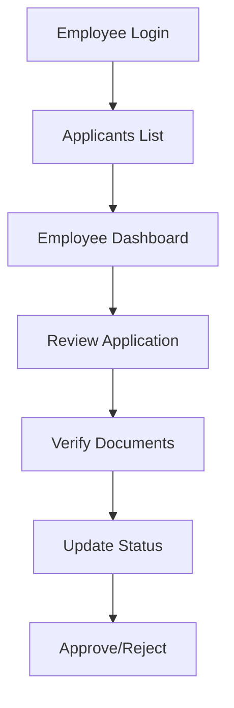

# 🏢 HDFC SME Loan Management System

<div align="center">


**Streamlined Business Loan Pre-Screening and Management System**

[](https://reactjs.org/)
[](https://nodejs.org/)
[](https://www.mongodb.com/)
[](https://tailwindcss.com/)

</div>

---

## 📋 Table of Contents

- [Overview](#overview)
- [Features](#features)
- [System Architecture](#system-architecture)
- [Workflow](#workflow)
- [Technology Stack](#technology-stack)
- [Project Structure](#project-structure)
- [Installation](#installation)
- [Configuration](#configuration)
- [API Documentation](#api-documentation)
- [Development](#development)
- [Contributing](#contributing)

---

## 🎯 Overview

The HDFC SME Loan Management System is a comprehensive full-stack application designed to streamline the process of business loan applications, document verification, and loan processing for Small and Medium Enterprises. The system provides separate interfaces for customers and employees, ensuring efficient workflow management from application submission to final approval.

---

## ✨ Features

### 👥 Customer Features
- **User Registration & Authentication** - Secure login system for loan applicants
- **SME Classification** - Automatic categorization based on investment and turnover
- **Loan Amount Calculation** - Dynamic loan amount suggestions based on SME category
- **Document Upload System** - KYC, Income Proof, and Business Proof submission
- **Application Dashboard** - Real-time tracking of application status and document verification
- **Multi-step Application Process** - Guided workflow for seamless user experience

### 🏛️ Employee Features
- **Employee Authentication** - Secure access for bank employees
- **Applicants Management** - Comprehensive list of all loan applications
- **Document Verification** - Review and verify uploaded documents
- **Application Status Management** - Approve, reject, or update application status
- **Dashboard Analytics** - Overview of applications and processing statistics

### 🔧 System Features
- **PDF Processing** - Automatic extraction and verification of document content
- **File Management** - Secure storage and retrieval of uploaded documents
- **Database Integration** - MongoDB for scalable data storage
- **RESTful API** - Well-structured API endpoints for all operations
- **Responsive Design** - Mobile-friendly interface using Tailwind CSS

---

## 🏗️ System Architecture

```
┌─────────────────┐    ┌─────────────────┐    ┌─────────────────┐
│   Frontend      │    │   Backend       │    │   Database      │
│   (React/Vite)  │◄──►│  (Express.js)   │◄──►│   (MongoDB)     │
│                 │    │                 │    │                 │
│ • Customer UI   │    │ • REST API      │    │ • Applicants    │
│ • Employee UI   │    │ • Auth System   │    │ • Documents     │
│ • Dashboard     │    │ • File Upload   │    │ • Users         │
└─────────────────┘    └─────────────────┘    └─────────────────┘
         │                       │                       │
         └───────────────────────┼───────────────────────┘
                                 │
                    ┌─────────────────┐
                    │   File Storage  │
                    │   (Local/Cloud) │
                    │                 │
                    │ • PDF Documents │
                    │ • KYC Files     │
                    └─────────────────┘
```

---

## 🔄 Workflow

### 📱 Customer Application Flow



#### Step-by-Step Process:

1. **🚀 Start Page** - Entry point with options for Customer Portal and Employee Access
2. **🔐 Customer Authentication** - Login or register new account
3. **👤 Client Verification** - Check existing client or create new applicant profile
4. **📊 SME Classification** - Input investment and turnover for automatic categorization
5. **💰 Loan Amount Selection** - View recommended loan amount based on SME category
6. **📄 Document Upload** - Submit required documents:
   - **KYC Documents** - Owner Aadhar, PAN, Business PAN
   - **Income Proof** - Bank statements, ITR, P&L statements
   - **Business Proof** - Registration documents, certificates
7. **📈 Dashboard** - Monitor application status and document verification
8. **✅ Status Tracking** - Real-time updates on application progress

### 🏢 Employee Management Flow



#### Employee Responsibilities:

1. **🔐 Employee Login** - Secure authentication for bank employees
2. **📋 Applicants List** - View all loan applications in the system
3. **📊 Employee Dashboard** - Analytics and overview of processing metrics
4. **🔍 Application Review** - Detailed review of each application
5. **📄 Document Verification** - Validate uploaded documents and PDFs
6. **📝 Status Updates** - Update application status (Pending/Approved/Rejected)
7. **✅ Final Decision** - Approve or reject loan applications

---

## 🛠️ Technology Stack

### Frontend
- **⚛️ React 19.2.0** - Modern React with hooks and functional components
- **⚡ Vite 7.2.4** - Fast build tool and development server
- **🎨 Tailwind CSS 4.1.17** - Utility-first CSS framework
- **🧭 React Router 7.9.6** - Client-side routing
- **📡 Axios 1.13.2** - HTTP client for API requests
- **🎭 React Icons 5.5.0** - Icon library for UI components

### Backend
- **🚀 Node.js** - JavaScript runtime environment
- **🌐 Express.js 5.1.0** - Web application framework
- **🗄️ MongoDB** - NoSQL database with Mongoose ODM
- **🔒 JWT** - JSON Web Token for authentication
- **📁 Multer** - File upload middleware
- **📄 PDF Libraries** - pdf-lib, pdf-parse, pdf.js-extract for document processing

### Development Tools
- **🛡️ ESLint** - Code linting and quality assurance
- **🔄 Nodemon** - Development server with auto-restart
- **📦 NPM** - Package management

---

## 📁 Project Structure

```
HDFC_Loan_5/
├── 📂 client/                     # Frontend React application
│   ├── 📂 public/                 # Static assets
│   │   └── hdfclogo.png          # HDFC logo
│   ├── 📂 src/                   # Source code
│   │   ├── 📂 components/        # Reusable React components
│   │   ├── 📂 pages/            # Page components
│   │   │   ├── 📂 Documents/    # Document upload pages
│   │   │   ├── ApplicantsList.jsx
│   │   │   ├── CheckClient.jsx
│   │   │   ├── CustomerAuth.jsx
│   │   │   ├── DashBoard.jsx
│   │   │   ├── EmployeeLogin.jsx
│   │   │   ├── LoanAmountPage.jsx
│   │   │   ├── SMEClassificationPage.jsx
│   │   │   └── StartPage.jsx
│   │   ├── 📂 assets/           # Static assets
│   │   ├── App.jsx             # Main app component
│   │   ├── index.css           # Global styles
│   │   └── main.jsx            # App entry point
│   ├── package.json            # Dependencies and scripts
│   ├── vite.config.js          # Vite configuration
│   └── README.md               # Client-specific documentation
├── 📂 server/                   # Backend Express application
│   ├── 📂 Documents/           # File storage directory
│   │   └── data.json          # Document metadata
│   ├── 📂 src/                # Source code
│   │   ├── 📂 controllers/     # Route controllers
│   │   ├── 📂 database/       # Database configuration
│   │   ├── 📂 middleware/     # Custom middleware
│   │   ├── 📂 models/         # Mongoose models
│   │   ├── 📂 routes/         # API routes
│   │   ├── 📂 utils/          # Utility functions
│   │   └── server.js          # Server entry point
│   └── package.json           # Dependencies and scripts
└── README.md                  # Project documentation
```

---

## 🚀 Installation

### Prerequisites
- **Node.js** (v18 or higher)
- **MongoDB** (local or cloud instance)
- **Git** for version control

### 1. Clone the Repository
```bash
git clone <repository-url>
cd HDFC_Loan_5
```

### 2. Backend Setup
```bash
cd server
npm install
```

### 3. Frontend Setup
```bash
cd client
npm install
```

### 4. Environment Configuration

#### Backend Environment (.env)
```env
PORT=8000
MONGO_URI=mongodb://localhost:27017/hdfc_loan_db
FRONTEND_ORIGIN=http://localhost:5173
JWT_SECRET=your-super-secret-jwt-key
```

#### Frontend Configuration
Update the API base URL in `client/src/config/api.js` if needed:
```javascript
const API_BASE_URL = 'http://localhost:8000/api';
```

---

## ⚙️ Configuration

### Database Setup
1. **Local MongoDB**: Ensure MongoDB is running locally
2. **Cloud MongoDB**: Update `MONGO_URI` in the backend .env file

### File Storage
- Documents are stored in `server/Documents/` directory
- PDFs are automatically processed for content extraction
- File metadata is maintained in `Documents/data.json`

### Authentication
- JWT tokens are used for session management
- Separate authentication for customers and employees
- Tokens are stored in localStorage/sessionStorage

---

## 📚 API Documentation

### Authentication Endpoints
```
POST /api/auth/register     # Customer registration
POST /api/auth/login        # Customer login
POST /api/auth/employee/login # Employee login
GET  /api/auth/profile      # Get user profile
```

### Applicant Management
```
POST /api/applicant/new     # Create new applicant
GET  /api/applicant/:id     # Get applicant by ID
GET  /api/applicant/full/:id # Get full applicant details
GET  /api/applicant/all     # Get all applicants (Employee only)
PATCH /api/applicant/update/:id # Update applicant flags
```

### Document Management
```
POST /api/kyc/upload        # Upload KYC documents
POST /api/business-proof/upload # Upload business proof
POST /api/income-proof/upload   # Upload income proof
GET  /api/documents/:id     # Get documents for applicant
```

### SME Classification
```
POST /api/classify/sme      # Classify SME based on investment/turnover
```

---

## 🧪 Development

### Running the Application

#### Start Backend Server
```bash
cd server
npm run dev
# Server runs on http://localhost:8000
```

#### Start Frontend Development Server
```bash
cd client
npm run dev
# Frontend runs on http://localhost:5173
```

### Building for Production

#### Build Frontend
```bash
cd client
npm run build
```

#### Production Server
```bash
cd server
npm start
```

### Code Quality
```bash
# Lint frontend code
cd client
npm run lint
```

---

## 🧪 Testing

### Manual Testing Checklist

#### Customer Journey
- [ ] Registration and login functionality
- [ ] SME classification with various inputs
- [ ] Document upload for all categories
- [ ] Dashboard updates and status tracking

#### Employee Journey
- [ ] Employee login with valid credentials
- [ ] View all applicants list
- [ ] Document verification process
- [ ] Status update functionality

#### System Testing
- [ ] Database connectivity
- [ ] File upload and storage
- [ ] PDF processing and extraction
- [ ] Error handling and validation

---

## 🔒 Security Features

- **JWT Authentication** - Secure token-based authentication
- **Role-based Access** - Separate permissions for customers and employees
- **File Validation** - PDF verification and content extraction
- **Input Sanitization** - Protection against XSS and injection attacks
- **CORS Configuration** - Proper cross-origin resource sharing setup

---

## 📊 Database Schema

### Key Collections

#### Applicants
```javascript
{
  Applicant_ID: String,
  fullName: String,
  email: String,
  phone: String,
  Applicant_industry: String,
  LoanAmount_Requested: Number,
  Loan_Category: String,
  SME_Category: String,
  KYC_Submitted: String,
  Income_Proof_Submitted: String,
  Business_Proof_Submitted: String,
  applicationStatus: String
}
```

#### Documents
```javascript
{
  applicantId: String,
  documentType: String,
  fileName: String,
  filePath: String,
  uploadDate: Date,
  verificationStatus: String
}
```

---

## 🚀 Deployment

### Production Considerations
1. **Environment Variables** - Use secure environment configuration
2. **Database Security** - Implement proper MongoDB security measures
3. **File Storage** - Consider cloud storage solutions for scalability
4. **SSL/TLS** - Enable HTTPS for secure communication
5. **Load Balancing** - Implement load balancing for high availability

### Docker Deployment (Optional)
```dockerfile
# Dockerfile examples can be added here
```

---

## 🤝 Contributing

### Development Guidelines
1. **Code Style** - Follow ESLint configuration
2. **Commit Messages** - Use conventional commit format
3. **Testing** - Test thoroughly before submitting PRs
4. **Documentation** - Update documentation for new features

### Getting Started with Development
1. Fork the repository
2. Create a feature branch
3. Make your changes
4. Test thoroughly
5. Submit a pull request

---

## 📝 License

This project is proprietary software developed for HDFC Bank. All rights reserved.

---

## 📞 Support

For technical support or questions:
- **Development Team**: [Contact Information]
- **System Documentation**: This README file
- **API Documentation**: Available at `/api/docs` when server is running

---

## 🔄 Version History

- **v1.0.0** - Initial release with core functionality
- **v1.1.0** - Enhanced document processing capabilities
- **v1.2.0** - Improved employee dashboard and analytics

---

<div align="center">

**Built with ❤️ for HDFC Bank SME Lending**

[](https://reactjs.org/)
[](https://nodejs.org/)

</div>
